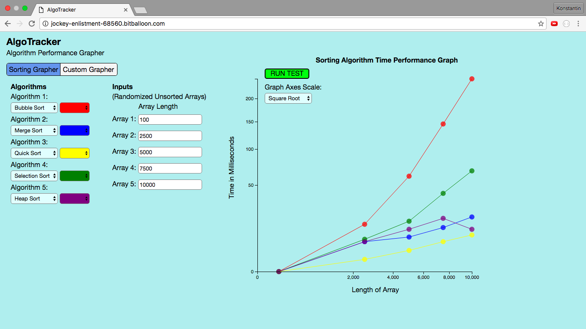
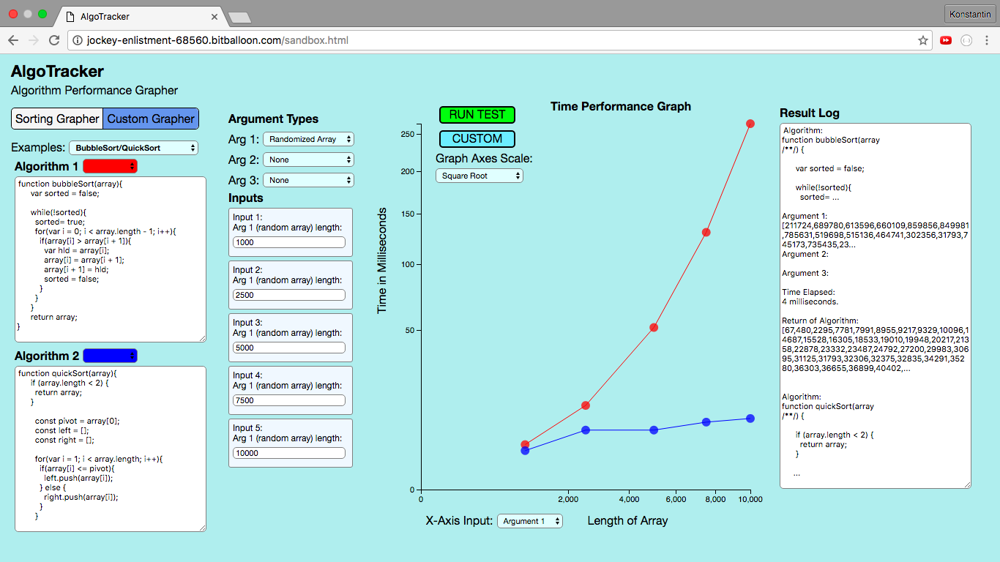

# AlgoTracker

###[Link to AlgoTracker](http://jockey-enlistment-68560.bitballoon.com/)

This application graphs the run time of various algorithms across numerous inputs. The application consists of two parts. The first part of the application is a sorting algorithm performance grapher that compares the run time of six popular sorting algorithms based on five randomized unsorted arrays of different lengths (chosen by the user). This part of the app is intended to be used for CS education purposes. The second part of the application allows a user to write up to two custom Javascript functions and compare their run times against each other across five inputs via a graph and a simulated console's result log. This part of the app can be used by developers to test the speed of their algorithms.

AlgoTracker was developed using Javascript, D3, and HTML/CSS.

## Sorting Algorithm Performance Grapher Features

- [ ] Graphs sorting algorithms' run times based on inputs on randomized unsorted arrays.
- [ ] User may select up to five algorithms to graph and their representative graph colors.
- [ ] User may select up to five unsorted input arrays and their lengths.
- [ ] User may select axes scale for graph (linear or square root).
- [ ] Graph axes automatically adjust to accommodate the largest array input size.

## Custom Algorithm Performance Grapher Features

- [ ] Graphs up to two custom Javascript algorithm run times entered by user in custom console across five inputs.
- [ ] Each algorithm accepts up to three arguments, including, if chosen, sorted and unsorted arrays of any lengths, which the application helps to generate for the user based on specified length and array type.
- [ ] User may select x-axis argument (assuming algorithm has multiple arguments that may be graphed as x-axis inputs).
- [ ] Includes examples of popular algorithms for demonstration purposes (e.g. Binary Search).
- [ ] Algorithm run results are displayed in custom output console to the right of the graph.
- [ ] User may select axes scale for graph (linear or square root).
- [ ] Graph axes automatically adjust to accommodate the largest array input size.

## Views





####Sample Code Snippet:

######Custom Console (Parser and New Function Creation)

```javascript


function parseAlgo(algo){
  var args = algo.substring(algo.indexOf("(") + 1, algo.indexOf(")"));
  var argsArray = args.split(", ");
  functionName = algo.substring(algo.indexOf("n ") + 2, algo.indexOf("("));
  functionArgCount = argsArray.length;
  if (argsArray[0] == ""){
    functionArgCount = 0;
  }

  if(functionArgCount !== inputArgCount){
    window.alert(
`Error: your algorithm(s) takes ${functionArgCount} argument(s) but your input has ${inputArgCount} argument(s).
Please make sure the number of arguments your algorithm(s) accept are the same as the number of argument inputs.`);
  }

  var cnt = 0;
  var lastBracket;
  while (cnt < algo.length){
    if(algo[cnt] === "}"){
      lastBracket = cnt;
    }
    cnt += 1;
  }

  var body = algo.substring(algo.indexOf("{") + 1, lastBracket);
  var exp = new RegExp(functionName, 'gi');
  body = body.replace(exp, 'arguments.callee');

  if (argsArray[0] === ""){
    return new Function(body);
  } else if (argsArray.length === 1){
    return new Function(argsArray[0], body);
  } else if (argsArray.length === 2){
    return new Function(argsArray[0], argsArray[1], body);
  } else if (argsArray.length === 3){
    return new Function(argsArray[0], argsArray[1], argsArray[2], body);
  }
}

```

######Sorting Algorithm Benchmarking and Graph Drawing Functions

```javascript

function runSort(){
  sizeAlert();
  dataset = [];
  algos = [];
  algoColors = [];
  setAlgos();
  var inputArrays = [];

  for(var i = 0; i < 5; i++){
    var inputLength = document.getElementById(`sort-input-${i + 1}`).value;
    inputArrays.push(createRandArray(inputLength));
  }

  inputArrays.sort(function(a,b){
    return b.length - a.length;
  });

  inputArrays.forEach(function(inputArray){
    for(var j = 0; j < algos.length; j++){
      var color = algoColors[j];
      timeTracker(algos[j], inputArray.slice(), color);
    }
  });

  draw();
}

function timeTracker(algo, arg, color){
  if(algo.name !== "none"){
    var startTime = new Date();
    var result = algo(arg);
    var endTime = new Date();
    var timeElapsed = endTime - startTime;
    dataset.push([arg.length, timeElapsed, algo.name, color]);
  }
}


function setCoords(){
  coords = [];
  dataset.forEach(function(circle, idx){
    if(dataset[idx + algos.length]){
      if(dataset[idx][2] == dataset[idx + algos.length][2]){
        coords.push([dataset[idx][0], dataset[idx][1],
          dataset[idx + algos.length][0], dataset[idx + algos.length][1], circle[3]]);
      }
    }
  });
}

function draw(){
  setCoords();
  d3.select("div.sort-graph").html("");

  if(document.getElementById("axis-scale").value === "sqrt"){
    axisScale = "sqrt";
  } else {
    axisScale = "linear";
  }

  var w = 650;
  var h = 550;
  var padding = 50;

  var svg = d3.select("div.sort-graph")
              .append("svg")
              .attr("width", w)
              .attr("height", h);


  var xScale = d3.scale.linear()
  var yScale = d3.scale.linear()
  var rScale = d3.scale.linear()

  if(axisScale === "sqrt"){
    xScale = d3.scale.sqrt()
    yScale = d3.scale.sqrt()
    rScale = d3.scale.sqrt()
  }

  xScale.domain([0, d3.max(dataset, function(d) { return d[0]; })])
         .range([padding, w - padding * 2]);

  yScale.domain([0, d3.max(dataset, function(d) { return d[1]; })])
        .range([h - padding, padding]);

  rScale.domain([0, d3.max(dataset, function(d) { return d[1]; })])
        .range([2, 5]);

  svg.selectAll("circle")
     .data(dataset)
     .enter()
     .append("circle")
     .attr("cx", function(d) {
       return xScale(d[0]);
     })
     .attr("cy", function(d) {
       return yScale(d[1]);
     })
     .attr("r", 6)
     .attr("opacity", 0.75)
     .attr("fill", function(d) {
       return d[3];
     });

  svg.selectAll("line")
     .data(coords)
     .enter()
     .append("line")
     .attr("x1", function(d) {
       return xScale(d[0]);
     })
     .attr("y1", function(d) {
       return yScale(d[1]);
     })
     .attr("x2", function(d) {
       return xScale(d[2]);
     })
     .attr("y2", function(d) {
       return yScale(d[3]);
     })
     .attr("stroke-width", 1)
     .attr("stroke", function(d) {
       return d[4];
     });

  svg.append("g")
         .attr("class", "axis")
         .attr("transform", "translate(0," + (h - padding) + ")")
         .call(d3.svg.axis()
                     .scale(xScale)
                     .orient("bottom")
                     .ticks(6));

  var yAxis = d3.svg.axis()
                   .scale(yScale)
                   .orient("left")
                   .ticks(6);

  svg.append("g")
     .attr("class", "axis")
     .attr("transform", "translate(" + padding + ",0)")
     .call(yAxis);
}
