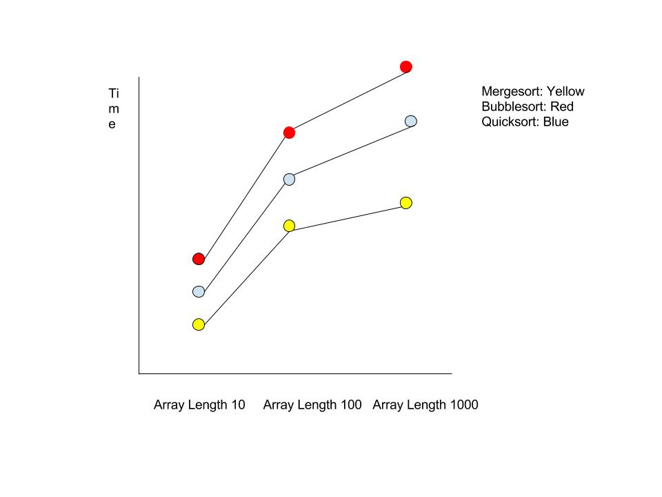
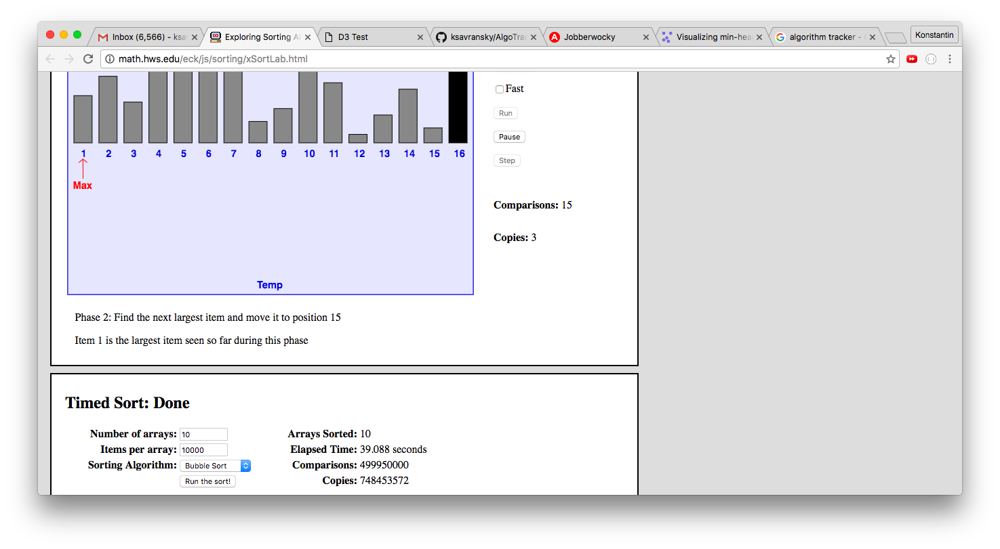

# AlgoTracker

## Minimum Viable Product

This project is an algorithm performance measuring app, written in Javascript and D3.

On week 12, day 1, this app will satisfy the following criteria:

- [ ] An app that graphs the time performance of various sorting algorithms
- [ ] A production README, replacing this README

- [ ] Features
  - [ ] Compares time performance of various sorting algorithms on a graph
  - [ ] X-axis will measure number of elements in array
  - [ ] Y-axis will measure time to sort completion
  - [ ] Points on graph will represent various algorithms' performance
  - [ ] Input control will allow control over array length
  - [ ] Input control will allow for test of custom array

## Views

# Implementation Timeline

**Phase 1**: Learn D3 and create basic graphing system (2 days Wed)

**Phase 2**: Create algorithm benchmarking  (2 days Fri)

**Phase 3**: Link the two above and allow for custom input (1 day Sat)

**Phase 4**: Bonus Features (1 day Sun)

### Bonus Features (TBD)

**Objective**: Compare different classes of algorithms beyond sorting. Create some kind of visualization system for each step.
